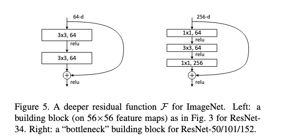

# Image Classification SOTA
Some tests on the state of the art in image classification (as of November 2021). I've tested three architectures

- Original ResNet https://arxiv.org/abs/1512.03385
- EfficientNet https://arxiv.org/abs/1905.11946
- Vision Transformer (ViT) https://arxiv.org/abs/2010.11929

## Original ResNet
The original resnet model proposed in 

He, Kaiming, et al. "Deep residual learning for image recognition." Proceedings of the IEEE conference on computer vision and pattern recognition. 2016.

, for the task of Image classification. I will train and evaluate a small version of this model on the tiny Imagenet dataset. The dataset contains 100,000 images of 200 classes (500 for each class) downsized to 64×64 colored images. Each class has 500 training images, 50 validation images, and 50 test images.

In implementing the Resnet I will follow the excellent "The Annotated Transformer" https://nlp.seas.harvard.edu/2018/04/03/attention.html which provides a very coincice way of implementing large and complex models.

Let's first define the main building block of the Resnet architecture, the ResNet block. 

The main feature of the ResNet block is that it computes

instead of 
$\boldsymbol{y} = \mathrm{f}(\boldsymbol{x},{\mathrm{W}_i})$
. It therefore consists of the usual operations of a convolutional architecture, with the modification that the input to a layer is added to the output.

## EfficientNet
The EfficientNet model proposed in

Tan, Mingxing, and Quoc Le. "Efficientnet: Rethinking model scaling for convolutional neural networks." International Conference on Machine Learning. PMLR, 2019.

, for the task of Image classification. I will train and evaluate a small version of this model on the tiny Imagenet dataset. The dataset contains 100,000 images of 200 classes (500 for each class) downsized to 64×64 colored images. Each class has 500 training images, 50 validation images, and 50 test images.

The empirical results of this approach are impressive. The authors claimed (in 2020) to be able to achieve a new state of the art 84.3% top-1 accuracy on Imagenet while being ~8x smaller and ~5x faster than the existing SOTA, ResNet-152 and GPPipe. 

The main feature of the EfficientNet is an appropriate scaling of convolutional deep neural networks across layer width, layer depth and layer resolution. In plain terms layer width corresponds to the number of channels per layer, layer depth corresponds to the number of stacked layers, and layer resolution corresponds to the dimensions of the feature maps per layer. The authors essentially note that previous works have either increased depth, increased width or increased the resolution so as to increase model expressivity and therefore (hopefully accuracy). They propose that instead of increasing each of the above independently one is better of by starting from an initial network and increasing all of the above concurently. The name this sort of scaling compound scaling. Below is an image of this approach.

## Vision Transformer (ViT)
The current state of the art in Imagenet as of 19/11/2021 is CoAtNet a model that combines the convolutional and attention paradigms. There are many reasons why applying attention to image classification is appealling. First of all attention models such as Bert have achieved state of the art in NLP tasks. It is therefore natural to see if they can be adapted to other types of signals such as images. A more fundamental reason is that while convolutions are a great inductive bias for images they are also a very strong bias, strongly "attending" to local information in an image. Various works have shown that the effective receptive field of deep convolutional architectures is small https://www.cs.toronto.edu/~wenjie/papers/nips16/top.pdf . Attention layers could potentially overcome this problem as they are able to encode dependencies in between arbitrary distances of image patches.

We will follow the paper titled

Dosovitskiy, Alexey, et al. "An image is worth 16x16 words: Transformers for image recognition at scale." arXiv preprint arXiv:2010.11929 (2020).

The main idea in this paper is to use a standard multihead attention architecture over patches of images for image classification. The attention mechanism learns to encode biases similar to convolutions as has been demonstrated before in another paper. Cordonnier, Jean-Baptiste, Andreas Loukas, and Martin Jaggi. "On the relationship between self-attention and convolutional layers." arXiv preprint arXiv:1911.03584 (2019). The resulting architecture called ViT (Visual Transformer) tends to outperform or perform similarly to other architectures such as ResNets while having a much smaller computational budget. The main caveat is that vision tranformers underperform compared to resnets when data is "scarce" and there is no pretraining. Intuitively the convolution bias in very useful in this regime. However this changes when we have access to more abundant data. In this setting ViTs can both learn convolutions in the early layers AND encode longer dependencies in subsequent layers.
